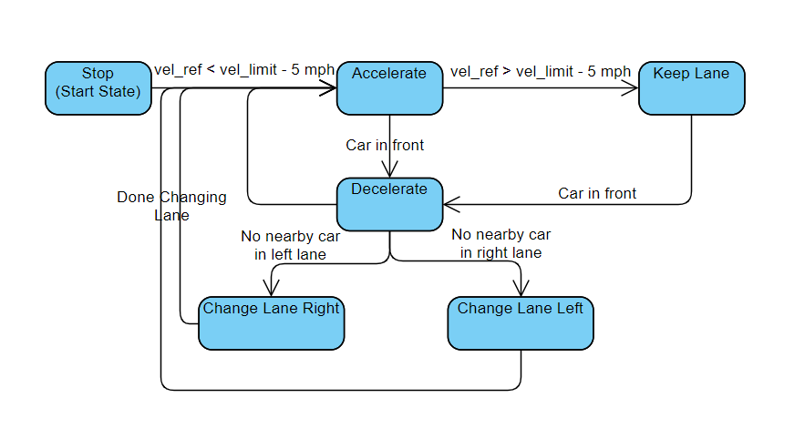
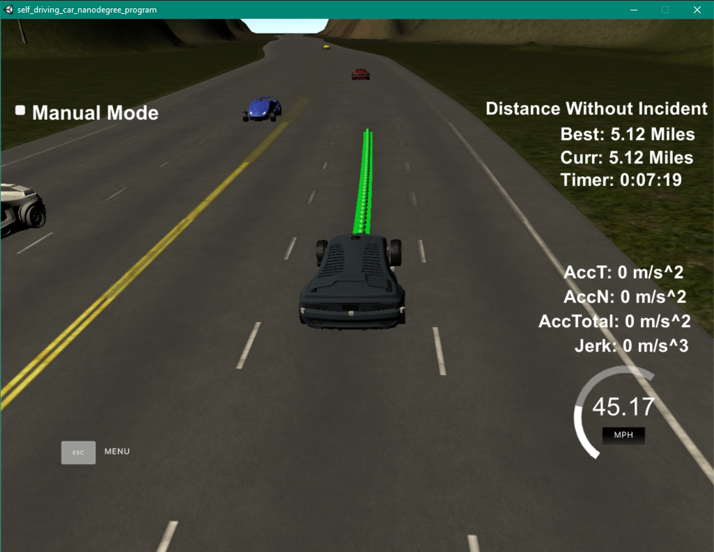
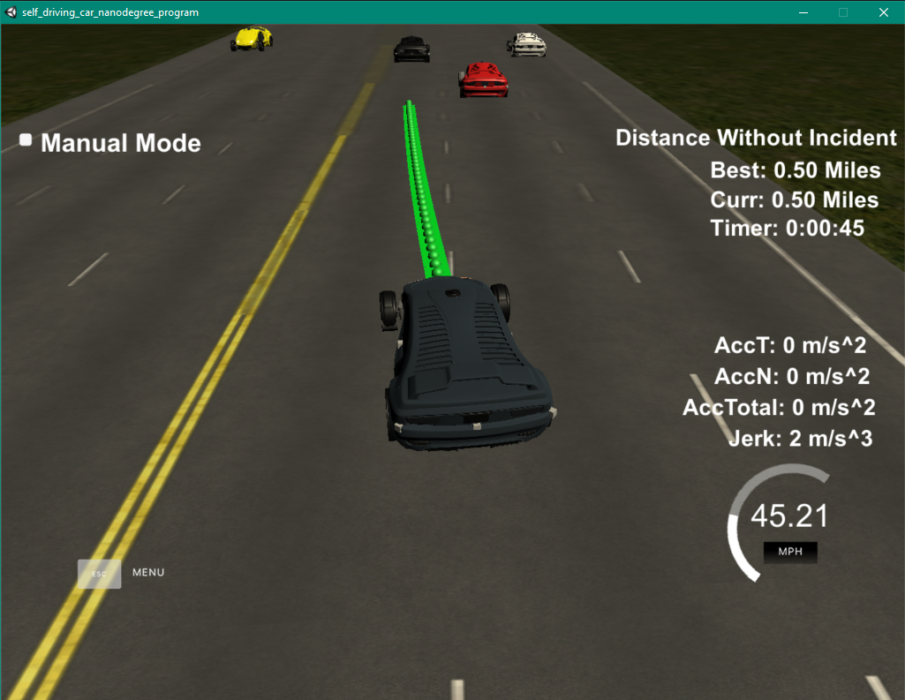

# Path Planning in Car Simulation

The goal of this project is to:
* create a path planning logic in C++
* build and run the program in the simulation
* keep the car below speed limit (50 mph), acceleration limit (10 m/s^2), and jerk limit (10 m/s^2)
* avoid any collision or accidents for at least 4.32 miles
* change lane when there is car in front and it's safe to change lane to either side

## State Machine Logic

### State Machine Diagram

### Description

The car start at a stop state, and it will keep accelerating until it reach around 5 mph below the speed limit or there is a vehicle infront. If there is a vehicle infront, the car will decelerate to keep its distance. The car will look to see if there is any vehicle in the left lane and right lane that is near itself by certain distance. If no, the car will prioritize going left, but if it's not free, the car the change to right lane. 

## Path Generation

During the start, the path is generate from the position of the car. The next point are store inside `ptsx` and `ptsy`. First I include the last datapoint of the previous position as the starting point of the new path. Then I the next 3 waypoints which are 30 m apart, starting from the current position along the road. The planning is done in Frenet coordinate, then convert to XY coordinate before pushing into the data points storage. This is to provide smooth transition.

The `lane` variable is used to control the lane that we want to go. The car_d start from 0, at the left lane line of the first lane, and end at 12, the right lane line of the 3rd lane. Giving that the lane is 4 meters apart, we can calculate the position of the center of each lane. By chaging the lane, I can specify which lane I want to end up with.

The datapoints are then put into the spline object. The point in the spline are distance 30 meter apart. After I get the spline object points, I push those points into the `next_x_vals` and `next_y_vals`. 

## Result

The car is able to achive the goal of not having accidents for 4.32 miles and did not break any traffic law.

It is also able to change lane when there is car in front and is safe to swich to left or right lane.

## Discussion

### Challenge

The first challenge is to understand the data given to us. The data include the car state, the sensor fusion, and the map. Moreover, another chanllenge is to create a smooth transition of points of car path.

### Further Improvement

The lane changing logic can be improve by taking into account the speed of the car nearby. There are some situation where the car see that the lane is safe and start changing lane, but the car behind speed up and hit the rear. Therefore, the threshold distance could be improve.